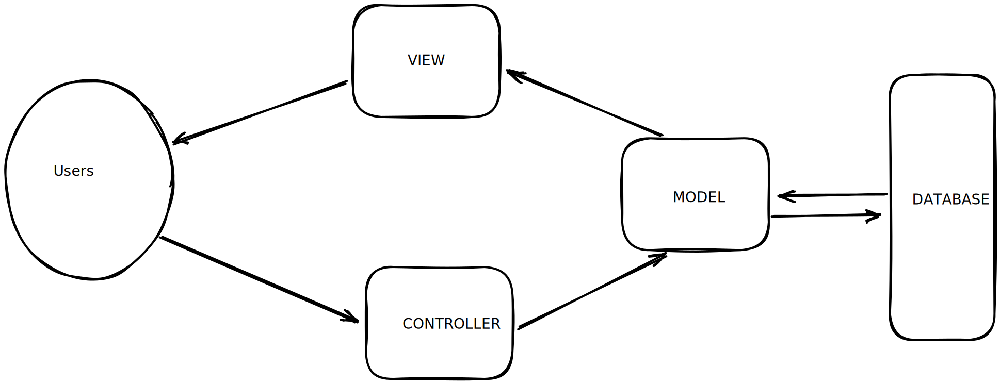

# Game Challenge

## Explanation

In this project, you are expected to develop a web application which shows “real-time” scores and statistics of NBA. In this project the first week of a NBA fixture will be simulated. All matches will start at the same time and will last 48 minutes and every minute will be simulated as 5 seconds which means whole match will end in 240 seconds.

For example;

Five seconds after the match starts 1 minute will be considered gone by. The maximum attack time will be 24 seconds. Depending on the “basket”, every five seconds the scores of the all the matches will be updated. After 48 updates, the matches will be over and the league table will be updated.

While the matches go on, the following stats will be shown in UI.

- Attack count
- Total score
- Player based assists
- Player based 2 or 3 points success rate.

## Quick Start

`Application start`

```Bash
# Start make file
$ make -f Makefile  

# Start start.sh
$ ./start.sh

# buid container and run 
$ docker build -t nba .
$ docker run -dp 3000:3000 nba
```

`Database Start`

```Bash
# docker container
$ docker run --name postgres -e POSTGRES_PASSWORD=root -d -p 5432:5432 postgres
```

## System Design

### Architecture



### Database

1. ER Diagram


### Project Layout

```Bash
.
├── app
│   ├── adapters
│   ├── controllers
│   ├── middleware
│   ├── models
│   ├── routes
│   └── views
├── assets
│   └── img
└── docs
```

### Test

## Reference

- [NBA kural rehberi](https://www.eurosport.com.tr/basketbol/nba/2014-2015/nba-kural-rehberi_sto4456289/story.shtml)
- [NBA Fixtures](https://www.livesport.com/en/nba/fixtures/)
- [NBA Standings](https://www.espn.com/nba/standings)

